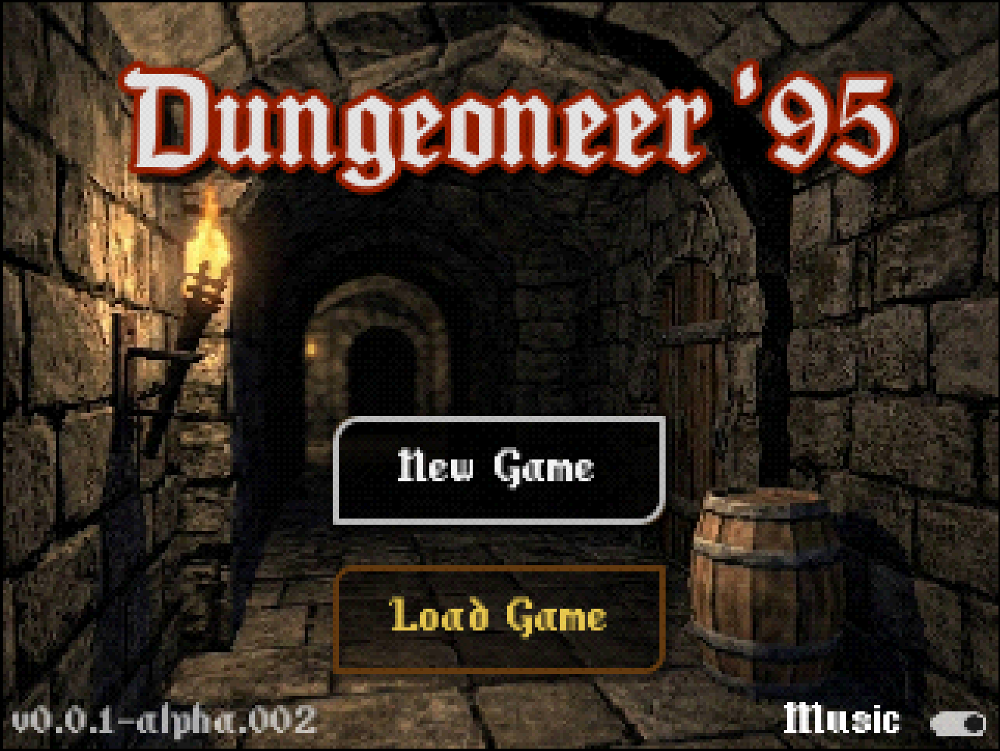
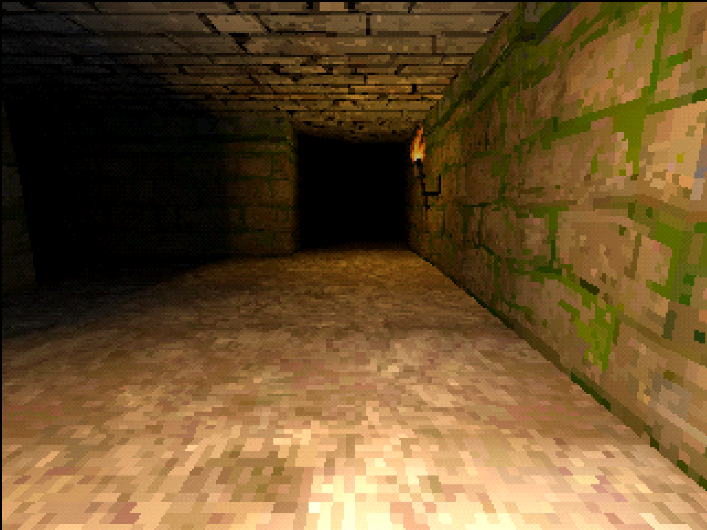
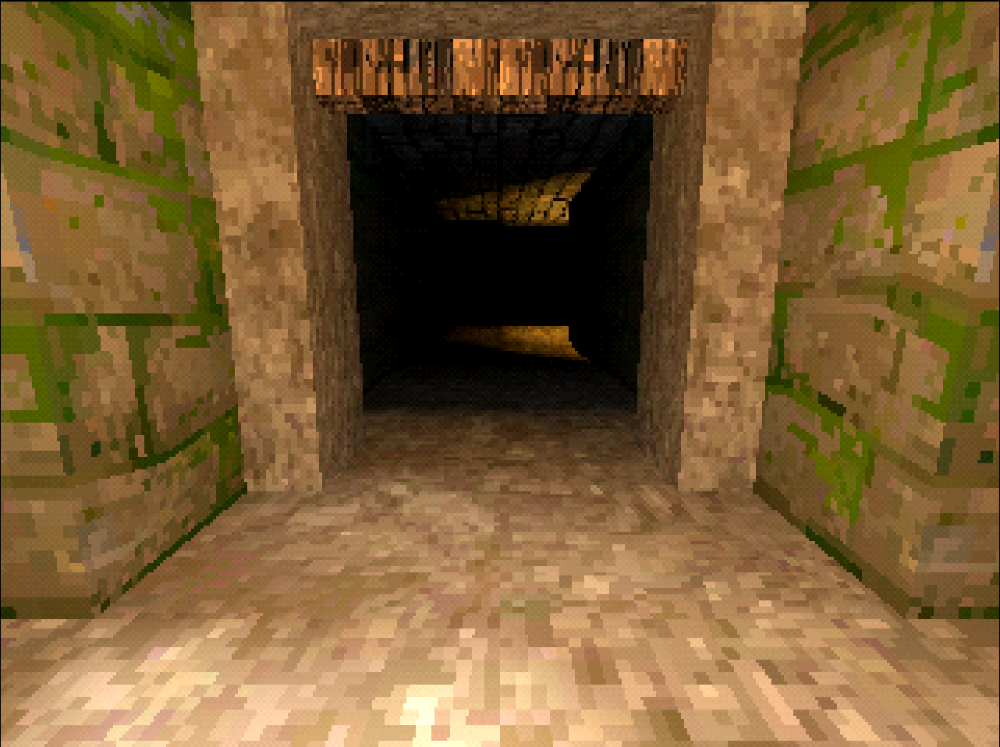

# Dungeoneer '95

A work-in-progress first-person dungeon crawler inspired by *Dungeon Master*
and *Eye of the Beholder*, with a deliberately retro, PS1-style look. Built
with Godot 4.7, GDScript and the GL Compatibility renderer.

## Run the game

1. Install Godot 4.7.
2. Open this repository's `project.godot` in Godot.
3. Run the project with **F5** or the editor's Run Project button.
4. Choose **New Game** to start the current level, Tomb of Valis.

No external dependencies or build steps are required. The project uses a
320x240 viewport with integer scaling.

## How the retro look works

The look is built from a few separate techniques rather than one filter:

- **Low-resolution rendering:** Godot renders to a 320x240 viewport, then
  scales it to the window in integer steps. The configured 1280x960 window is
  a 4x scale. This gives the whole image a coarse pixel grid.
- **Nearest-neighbour sampling:** Project canvas textures and the 3D material
  shader use nearest filtering, keeping texture pixels sharp instead of
  blending neighbouring texels.
- **PS1-style 3D materials:** `materials/ps1.gdshader` is used by the map
  cells, doors and buttons. It snaps geometry towards a screen-pixel grid and
  blends in affine texture mapping, where texture coordinates are not
  perspective-corrected. This recreates the characteristic vertex jitter and
  texture warping associated with early 3D hardware. The shader exposes
  `snap_pixels` and `affine_strength` to tune those effects per material.
- **Output dithering and colour quantisation:** `misc/ps1_output.gdshader`
  samples the rendered screen, applies a repeating 4x4 ordered Bayer dither,
  then rounds each colour channel to 32 levels (5 bits). In the game scene,
  dither strength is set to 1.0.

The game uses Godot's GL Compatibility renderer. The title scene has the same
output shader assigned, but its post-process layer is currently hidden, so
the output dither and colour quantisation apply to gameplay, not the title
screen. This is an oversight. These effects give a retro presentation; they
do not simulate every limitation of original PlayStation hardware.

## Controls

| Action | Keyboard | Controller |
| --- | --- | --- |
| Move forward / backward | W / S or Up / Down | D-pad up / down |
| Turn left / right | A / D or Left / Right | D-pad left / right |
| Strafe left / right | Q / E | Left shoulder buttons |
| Interact | Space | A |
| Show or hide pause HUD | Escape | Start |
| Look around | - | Right stick |

Movement advances one tile at a time. Turns are in 90-degree increments.

## Current status

This is an early prototype. New Game starts the Tomb of Valis level. The title
screen's Load Game button and a fully implemented pause system are not yet
available. Level loading and some feature placements are still being
developed.

## Project layout

- `levels/`: TileMapLayer-authored level scenes and their shared TileSet.
- `src/`: Grid, world-state, player, title and game scripts.
- `templates/`: Reusable map-cell and feature scenes.
- `materials/`, `misc/`, `textures/`, `models/`, `fonts/`, `audio/`, `art/`:
  Game assets, materials and shaders.
